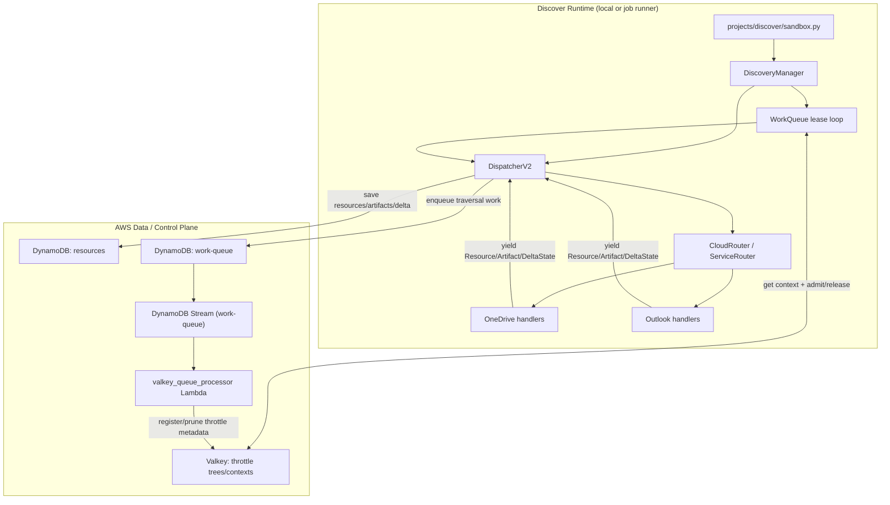
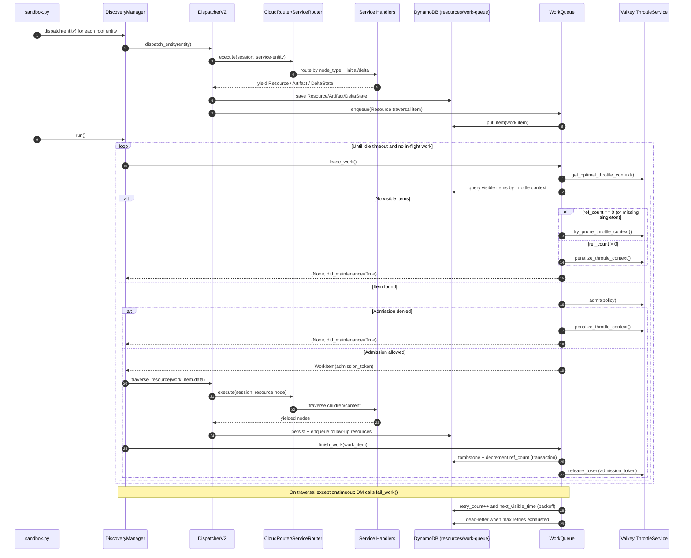

# Research: How we can best generate a diagram for discover

**Date**: 2026-02-12T18:53:33Z  
**Researcher**: GPT-5.3 Codex (Cursor)  
**Git Commit**: 350e143  
**Branch**: main  
**Repository**: filescience

## Research Question

Research how we can best generate a diagram for `discover`.

## Summary

The best-fit path in this repository is to use **Mermaid diagrams in Markdown** as the source of truth for `discover` flow documentation, then optionally export static images via `@mermaid-js/mermaid-cli` when PNG/SVG artifacts are needed.

Why this fits current repo state:
- `discover` already has a current, detailed textual code map in `memory-bank/thoughts/shared/research/2026-02-12-discover-code-map.md`.
- There are currently no existing Mermaid/PlantUML/Graphviz diagram assets or diagram build workflows in this repo.
- Markdown-first documentation is already the dominant format in `memory-bank/thoughts/`.

## Detailed Findings

### 1) Canonical `discover` flow sources already exist

- Runtime orchestration and loop behavior:
  - `DiscoveryManager` initialization, dispatch wiring, queue loop, and timeout/stop behavior in `bases/filescience/discover/manager.py`.
- Dispatch and enqueue boundaries:
  - `DispatcherV2` service fanout and resource enqueue in `bases/filescience/discover/dispatcher.py`.
- Queue leasing/admission/retry/dead-letter paths:
  - `WorkQueue` in `bases/filescience/discover/queue.py`.
- Cloud/service routing and handler registration:
  - `CloudRouter` / `ServiceRouter` in `bases/filescience/discover/clouds/router.py`.
  - O365 mount in `bases/filescience/discover/clouds/microsoft/cloud.py`.
  - OneDrive and Outlook node transitions in `bases/filescience/discover/clouds/microsoft/services/onedrive.py` and `bases/filescience/discover/clouds/microsoft/services/outlook.py`.
- Practical entrypoint used for local runtime flow:
  - `projects/discover/sandbox.py`.

### 2) Existing historical docs can directly seed diagram nodes/edges

- `memory-bank/thoughts/shared/research/2026-02-12-discover-code-map.md` already captures the end-to-end sequence (dispatch -> route -> enqueue -> lease -> traverse -> finish).
- `memory-bank/thoughts/shared/research/2026-02-12-discover-code-map-brief.md` provides a concise flow summary suitable for a top-level diagram caption.
- `.claude/projects/discover.md` contains state surfaces (DynamoDB, Valkey, Graph API, caches) that map well to system-boundary diagrams.

### 3) Current diagram tooling status in repo

- No `.mmd`, `.puml`, `.drawio`, `.dot`, or D2 diagram source files were found.
- No existing Mermaid diagram blocks were found in Markdown.
- No existing diagram-render build target was found.

### 4) Best generation method for this repo

Use a **2-step Markdown-native workflow**:

1. Keep diagram source as Mermaid code blocks in versioned Markdown near `discover` research/docs.
2. Optionally render PNG/SVG outputs when needed via `@mermaid-js/mermaid-cli`.

This keeps diagrams close to current documentation practices and minimizes additional infra.

## Recommended Diagram Shapes for `discover`

### A) System Interaction Diagram (context + boundaries)

Capture these components and edges:
- `sandbox.py` -> `DiscoveryManager`
- `DiscoveryManager` -> `DispatcherV2`
- `DispatcherV2` -> `CloudRouter`/`ServiceRouter` -> OneDrive/Outlook handlers
- `DispatcherV2` -> `resources` table + `work-queue` table
- `WorkQueue` <-> Valkey throttle contexts
- `work-queue` DynamoDB Stream -> `valkey_queue_processor` Lambda (stream-side throttle/metadata handling)

### B) Runtime Control-Flow Diagram (sequence/flowchart)

Capture this loop:
- Dispatch root entities by service.
- Handler yields `Resource`/`Artifact`/`DeltaState`.
- `Resource` items are persisted + enqueued.
- `run()` loop leases work, traverses, then `finish_work()`.
- Failure path uses retry backoff and dead-letter.

## Generated Diagram 1: Discover System Context

## Generated Diagram 2: Runtime Control Flow (Dispatch + Lease + Retry)

## Code References

- `projects/discover/sandbox.py:64-114` - discovery entry flow (collect entities, dispatch, wait for tree, run loop).
- `bases/filescience/discover/manager.py:128-136` - manager wiring of `WorkQueue` and `DispatcherV2`.
- `bases/filescience/discover/manager.py:293-321` - main lease/process loop and stop condition.
- `bases/filescience/discover/dispatcher.py:56-74` - root entity fanout into per-service entities.
- `bases/filescience/discover/dispatcher.py:117-150` - resource persist/enqueue path.
- `bases/filescience/discover/dispatcher.py:151-180` - router execution and item-type handling.
- `bases/filescience/discover/queue.py:229-312` - lease and maintenance path (prune/penalize when no work).
- `bases/filescience/discover/queue.py:557-706` - retry/backoff/dead-letter path.
- `bases/filescience/discover/clouds/router.py:33-59` - service handler registration/dispatch.
- `bases/filescience/discover/clouds/router.py:94-113` - cloud router execution context.
- `bases/filescience/discover/clouds/microsoft/cloud.py:7-10` - O365 router mount points.
- `bases/filescience/valkey_queue_processor/handler.py:297-515` - stream record routing + batch processing.

## External Documentation References

- Mermaid Markdown rendering support and syntax:  
  - https://github.com/mermaid-js/mermaid/blob/develop/docs/intro/getting-started.md
  - https://github.com/mermaid-js/mermaid/blob/develop/docs/syntax/flowchart.md
- Mermaid CLI rendering examples (`mmdc`):  
  - https://github.com/mermaid-js/mermaid-cli/blob/master/README.md

## Historical Context (from memory-bank/thoughts/)

- `memory-bank/thoughts/shared/research/2026-02-12-discover-code-map.md` - comprehensive current code map for discover.
- `memory-bank/thoughts/shared/research/2026-02-12-discover-code-map-brief.md` - concise summary of that map.
- `.claude/projects/discover.md` - current state surfaces and runtime touchpoints.

## Related Research

- `memory-bank/thoughts/shared/research/2026-02-12-discover-code-map.md`
- `memory-bank/thoughts/shared/research/2026-02-12-discover-code-map-brief.md`
- `memory-bank/thoughts/shared/research/2026-02-10-outlook-graph-throttling-compatibility.md`

## Open Questions

- Should the first diagram include only the `discover` base runtime, or also `entity_discovery_trigger` + stream processor Lambda as upstream/downstream context?
- Is a single high-level diagram sufficient, or are both context + sequence diagrams desired for handoff/debug workflows?
